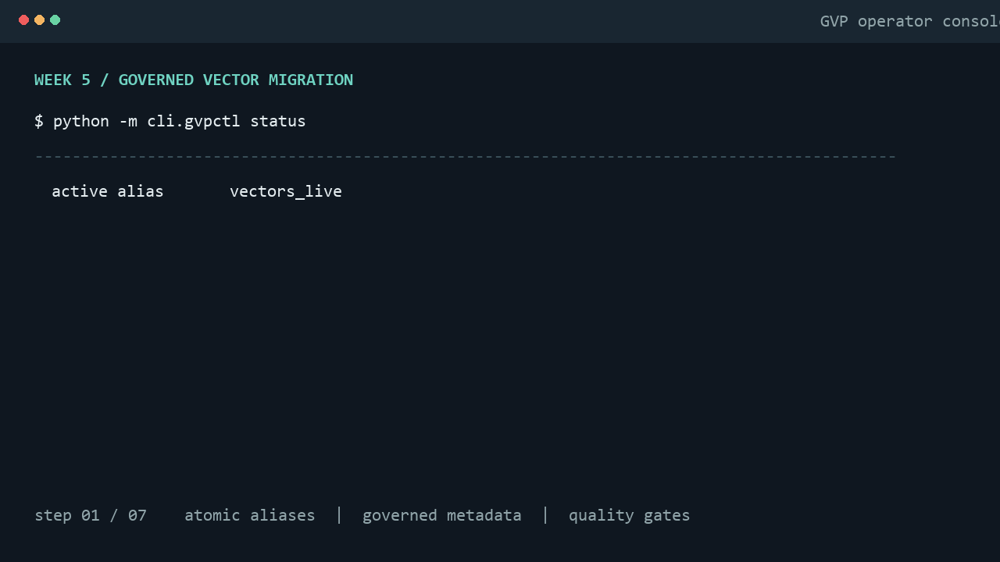
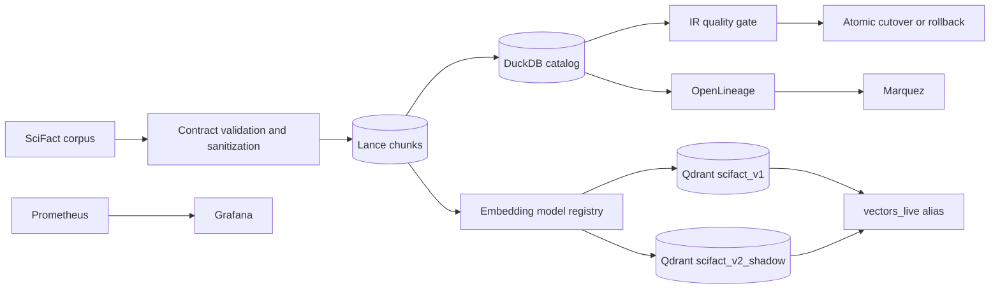

# Governed Vector Data Platform




An operator-focused control plane for governed vector data: versioned documents and chunks in Lance, catalog and lineage metadata in DuckDB, low-latency serving in Qdrant, and quality-gated embedding migrations with atomic cutover.

## The Unstructured Data Governance Gap

Vector indexes are often treated as disposable infrastructure even when they drive production search and RAG systems. That makes basic questions difficult to answer: which model produced a vector, which source revision it came from, whether a migration changed retrieval quality, and how to roll back without downtime.

This platform makes those answers operational. Every vector is associated with its source document, chunk strategy, model version, collection, and PII masking state. Migrations are planned before work begins, shadow-written away from live traffic, evaluated on the BEIR/SciFact benchmark, and switched through Qdrant's atomic alias API.

## Architecture



## Live CLI Walkthrough

Run commands from the repository root with the project virtual environment active:

```powershell
python -m cli.gvpctl status
python -m cli.gvpctl migrate plan "bge-small-en-v1.5" "bge-large-en-v1.5" --approve
python -m cli.gvpctl migrate apply "mig_scifact_v1_to_v2" --approve
python -m cli.gvpctl quality-gate check "mig_scifact_v1_to_v2"
python -m cli.gvpctl cutover execute "mig_scifact_v1_to_v2" --approve
python -m cli.gvpctl chaos inject --fail-rate 0.4 --migration-id "mig_scifact_v1_to_v2"
python -m cli.gvpctl cutover rollback "mig_scifact_v1_to_v2" --approve
```

`migrate apply` runs the quality gate automatically after shadow writing. Use `--skip-quality-gate` only for offline maintenance or test fixtures. A failed gate exits nonzero and leaves the live alias untouched.

## Benchmark Comparison

The quality gate persists one `retrieval_eval_runs` row for each model. Replace the placeholders below with a recorded evaluation run before publishing benchmark claims.

| Metric | Baseline: bge-small-en-v1.5 | Migrated: bge-large-en-v1.5 | Gate rule |
| --- | ---: | ---: | --- |
| Recall@10 | pending run | pending run | v2 >= v1 - 0.02 |
| NDCG@10 | pending run | pending run | v2 >= v1 |
| MRR | pending run | pending run | observed |
| p95 latency | pending run | pending run | observed |
| Embedding cost / 1K tokens | $0.00 | $0.00 | registry value |

## Observability

Start the local portfolio stack with:

```powershell
docker compose up -d
```

Then open:

- Marquez UI: `http://localhost:3000`
- Grafana: `http://localhost:3001` (`admin` / `admin`)
- Prometheus: `http://localhost:9090`
- Qdrant: `http://localhost:6333/dashboard`

The captured portfolio references are documented in [docs/RUNBOOK_MIGRATION.md](docs/RUNBOOK_MIGRATION.md). The dashboard is provisioned from [docker/grafana/dashboards/vector_platform.json](docker/grafana/dashboards/vector_platform.json), and OpenLineage events are emitted by [catalog/openlineage_emitter.py](catalog/openlineage_emitter.py).


## Quality and Governance

- SciFact qrels and query text are materialized in [evaluation/beir_scifact_qrels.json](evaluation/beir_scifact_qrels.json).
- Retrieval quality uses Recall@5, Recall@10, NDCG@10, and MRR from [evaluation/metrics.py](evaluation/metrics.py).
- Vector-space drift is measured by [evaluation/drift_detector.py](evaluation/drift_detector.py).
- Cutover authorization is enforced by [evaluation/quality_gate.py](evaluation/quality_gate.py).
- Migration recovery and operator procedures are in [docs/RUNBOOK_MIGRATION.md](docs/RUNBOOK_MIGRATION.md).

## Development

```powershell
python -m pip install -r requirements.txt
python -m pytest -q
```

The repository's current test suite covers ingestion, catalog and lineage behavior, migration planning, shadow writes, chaos recovery, cutover rollback, IR metrics, drift detection, and quality-gate invariants.