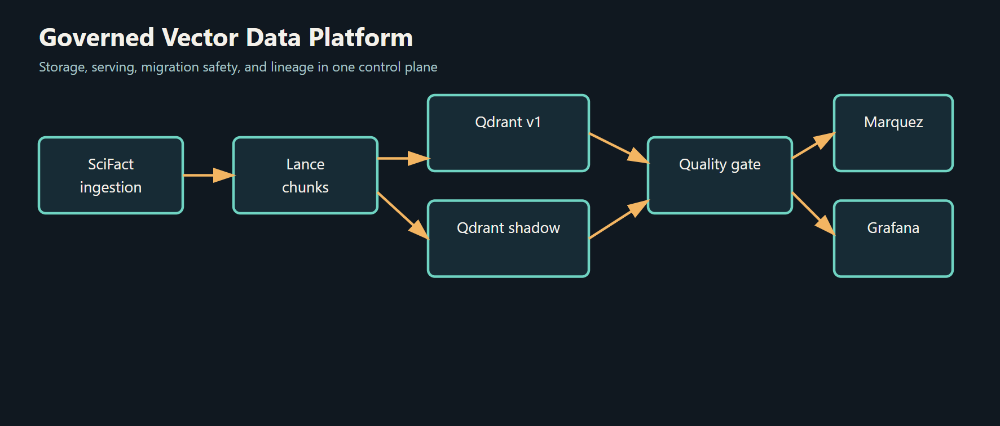

# Governed Vector Data Platform



An operator-focused control plane for governed vector data: versioned documents and chunks in Lance, catalog and lineage metadata in DuckDB, low-latency serving in Qdrant, and quality-gated embedding migrations with atomic cutover.

> **Status: baseline verified, migration path pending.** The 7,620-vector baseline, provenance catalog, API, and observability stack are live. The `bge-large` migration lifecycle is not yet run — see [Verified vs. Pending](#verified-vs-pending).

---

## Why This Exists

Vector indexes are commonly treated as disposable infrastructure even when they drive production search and RAG systems. That makes basic governance questions hard to answer: which model produced a vector, which source document it came from, whether a migration changed retrieval quality, and how to roll back without downtime.

This platform makes those answers operational:

- **Relational Provenance** — Every vector is traced back to its document revision, chunk strategy, model version, and PII masking state.
- **Zero-Downtime Migrations** — Migrations are planned upfront, shadow-written away from live traffic, evaluated on the BEIR/SciFact IR benchmark, and cut over through Qdrant's atomic alias API.
- **Enterprise Observability** — Native OpenLineage emission to Marquez and real-time telemetry in Grafana via Prometheus.

---

## Documentation

| Doc | Contents |
|---|---|
| [Architecture Specification](docs/ARCHITECTURE.md) | System design, ADRs, storage/serving separation, catalog schema |
| [Migration Runbook](docs/RUNBOOK_MIGRATION.md) | Step-by-step migration execution, quality gates, emergency rollback |
| [API Reference](docs/API_REFERENCE.md) | REST endpoints, search proxy routing, telemetry metrics |
| [CLI Reference (`gvpctl`)](docs/CLI_REFERENCE.md) | `status`, `lineage`, `migrate`, `quality-gate`, `cutover` |
| [IR Benchmark Guide](docs/IR_BENCHMARK_GUIDE.md) | BEIR SciFact dataset, Recall/NDCG/MRR metrics, drift analysis |
| [Demo Guide](Demo_Guide.md) | Filmed end-to-end runbook |

---

## Platform in Action

### Full backward lineage in a single API call

The centrepiece feature. One REST call returns the complete provenance chain for any vector — model, dimensions, source document, chunk strategy, the original chunk text, content hash, and PII state:


The same trace from the operator CLI:

```powershell
python -m cli.gvpctl lineage trace "vec_0001"
```

```
Vector: vec_0001
Document -> Chunk -> Model -> Qdrant Index
  vector_id : vec_0001
  document  : 4983 (v1)
  chunk     : 4983:0000
  model     : bge-small-en-v1.5:1.0.0
  collection: scifact_v1
  strategy  : fixed_size_v1:1.0.0
  source_uri: beir://scifact/4983
```

### Live search with per-request telemetry

Queries are embedded by the active model and served from Qdrant through the `vectors_live` alias:


```powershell
$r = Invoke-RestMethod -Method POST -Uri "http://localhost:8000/v1/search" `
  -ContentType "application/json" `
  -Body '{"query":"CRISPR-Cas9 genome editing mechanisms","top_k":3}'
$r.results | Format-Table id, score -AutoSize
```

```
id                                        score
--                                       ------
b2e95414-397b-57eb-b975-e107e1aeafb4  0.8404053
8fddfa45-160b-5fab-b719-a331ebc42c2c  0.8177236
d5fee0a9-a82b-59b2-9c92-22d425fa51dc  0.8021588
```

### Control plane API & observability

The FastAPI control plane exposes health, search, lineage, staleness, routing, and Prometheus metrics:


Grafana turns Prometheus scrapes into live latency percentiles, throughput, token, and cost panels:


---

## Operator CLI

```powershell
# Inspect platform health and vector distribution
python -m cli.gvpctl status

# Generate a pre-flight migration plan
python -m cli.gvpctl migrate plan "bge-small-en-v1.5" "bge-large-en-v1.5" --approve

# Shadow-write target embeddings (requires bge-large)
python -m cli.gvpctl migrate apply "<MIGRATION_ID>" --approve

# Run the automated IR quality gate (requires bge-large)
python -m cli.gvpctl quality-gate check "<MIGRATION_ID>"

# Atomic cutover, zero downtime (requires bge-large)
python -m cli.gvpctl cutover execute "<MIGRATION_ID>" --approve

# Instant rollback if needed
python -m cli.gvpctl cutover rollback "<MIGRATION_ID>" --approve
```

> `<MIGRATION_ID>` is minted fresh by each `migrate plan` call. Read it off the output table and reuse that exact value for subsequent steps.

---

## Verified vs. Pending

| Area | State | Notes |
|---|:---:|---|
| Infrastructure stack | ✅ | 6 containers up, Qdrant + Postgres healthy |
| SciFact ingestion | ✅ | 5,183 documents ingested |
| Chunking + embedding | ✅ | 7,620 chunks/vectors in `scifact_v1` |
| Governed catalog | ✅ | `gvpctl status` → `duckdb_sync: synced` |
| Provenance & lineage | ✅ | Full chain via API and CLI |
| Live search | ✅ | Real scores, alias-routed |
| Staleness tracking | ✅ | 7,620 active, 0 stale |
| API + telemetry | ✅ | All endpoints live |
| Prometheus → Grafana | ✅ | Target up, panels plotting |
| Test suite | ✅ | 78 passed (`pytest tests/ -q`) |
| Migration lifecycle | ⏳ | Requires `bge-large-en-v1.5` (1.34 GB) |
| Marquez lineage graph | ⏳ | UI reachable; populates after first migration run |
| IR benchmark results | ⏳ | Placeholder until shadow collection is populated |

---

## Benchmark: SciFact Ground Truth

Evaluated on 5,183 scientific paper abstracts against expert human relevance judgments. Quality gates enforce that a migration cannot cut over unless the target model meets or exceeds baseline retrieval performance.

| Metric | Baseline `bge-small-en-v1.5` (384d) | Target `bge-large-en-v1.5` (1024d) | Quality Gate |
|---|:---:|:---:|---|
| Recall@5 | — | — | observed |
| Recall@10 | — | — | `v2 >= v1 - 0.02` |
| NDCG@10 | — | — | `v2 >= v1` |
| MRR | — | — | observed |
| p95 Latency | — | — | observed |
| Error Rate | — | — | `= 0.0` |

> Results are pending the `bge-large` download and shadow collection build. Do not cite placeholder values as measured results.

---

## Running the Stack

```powershell
docker compose up -d
```

| Service | URL | Credentials |
|---|---|---|
| Qdrant Vector Engine | http://localhost:6333/dashboard | — |
| Marquez Lineage UI | http://localhost:3000 | — |
| Grafana Dashboards | http://localhost:3001 | `admin` / `admin` |
| Prometheus | http://localhost:9090 | — |

FastAPI runs separately from Docker Compose:

```powershell
python -m uvicorn api.main:app --host 127.0.0.1 --port 8000
```

- Health check: `GET /health` → `{"status":"ok"}`
- OpenAPI docs: http://localhost:8000/docs
- Prometheus metrics: `GET /metrics`

> ⚠️ **Do not re-run `python -m ingestion.bootstrap` unless you intend a full rebuild.** It unconditionally re-embeds all 7,620 chunks on CPU (~40 minutes) and requires exclusive DuckDB write access. See the [Demo Guide](Demo_Guide.md#part-a--one-time-build--already-done--do-not-re-run).

---

## Development & Tests

```powershell
python -m pip install -r requirements.txt
& .venv\Scripts\Activate.ps1
python -m pytest tests/ -q
```

```
78 passed, 1 warning in 11.16s
```

The suite covers ingestion and sanitisation, chunking, catalog schema and transactions, embedding and migration, quality gates, chaos resilience, OpenLineage facets, telemetry, and the CLI.

> `test_qdrant_client_matches_configured_server_api` queries the live Qdrant server — the stack must be running for this test to pass.
