# Governed Vector Data Platform

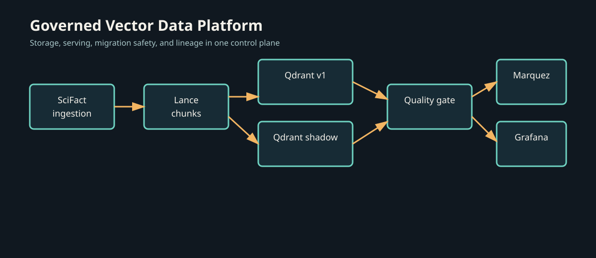

An operator-focused control plane for governed vector data: versioned documents and chunks in Lance, catalog and lineage metadata in DuckDB, low-latency serving in Qdrant, and quality-gated embedding migrations with atomic cutover.

> **Status: baseline verified, migration path pending.** The 7,620-vector baseline, its provenance catalog, the API, and the observability stack are live and reproduced below from this machine. The `bge-large` migration lifecycle is not yet run — see [Verified vs. Pending](#verified-vs-pending).

---

## 📚 Documentation Index

- [Architecture Specification](docs/ARCHITECTURE.md) — System design, ADRs, storage/serving separation, and catalog schema.
- [Production Migration Runbook](docs/RUNBOOK_MIGRATION.md) — Step-by-step migration execution, quality gates, and emergency rollback.
- [FastAPI Control Plane API Reference](docs/API_REFERENCE.md) — REST API endpoints, search proxy routing, and telemetry metrics.
- [Operator CLI Reference (`gvpctl`)](docs/CLI_REFERENCE.md) — Command reference for `status`, `lineage`, `migrate`, `quality-gate`, and `cutover`.
- [IR Benchmark & Quality Gate Guide](docs/IR_BENCHMARK_GUIDE.md) — BEIR SciFact dataset, IR metrics (Recall, NDCG, MRR), and drift analysis.
- [Demo Video Guide](Demo_Guide.md) — The filmed end-to-end runbook, plus which setup you never re-run.

---

## The Unstructured Data Governance Gap

Vector indexes are often treated as disposable infrastructure even when they drive production search and RAG systems. That makes basic questions difficult to answer: which model produced a vector, which source revision it came from, whether a migration changed retrieval quality, and how to roll back without downtime.

This platform makes those answers operational:
- **Relational Provenance**: Every vector is traced back to its document revision, chunk strategy, model version, and PII masking state.
- **Zero-Downtime Migration Control**: Migrations are planned before work begins, shadow-written away from live traffic, evaluated on the BEIR/SciFact benchmark, and switched through Qdrant's atomic alias API.
- **Enterprise Standards**: Native OpenLineage metadata emission to Marquez and real-time operational telemetry in Grafana.

---

## 📸 Platform in Action

Every screenshot below is real output from this system — captured from the live stack, the live API, or the live CLI. Only the architecture diagram is a drawing.

### The baseline: 7,620 governed vectors

SciFact is ingested, validated, chunked, embedded with `bge-small-en-v1.5` (384-dim, Cosine), and indexed into Qdrant. The `vectors_live` alias points at `scifact_v1`.

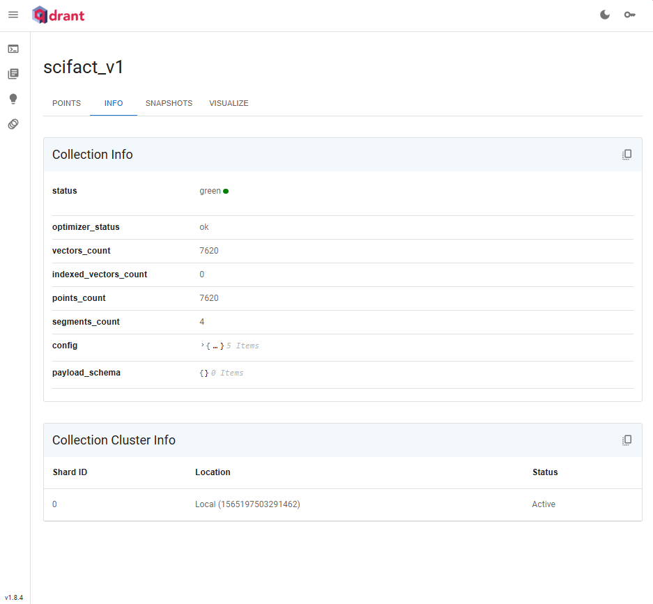

> **Approximate search is not active yet.** Qdrant's `indexing_threshold` is 20,000 and the baseline holds 7,620 vectors, so `indexed_vectors_count` is `0` and every query is an *exact* full scan. That is deliberate at this scale — brute-force cosine over 7,620 × 384-dim vectors is already sub-millisecond — but it means the HNSW path stays unexercised until the collection grows past the threshold.

### Full backward lineage, in one response

This is the centrepiece. A single REST call returns the complete provenance chain for a vector — model, dimensions, source document, chunk strategy, **the original chunk text**, content hash, and PII state:

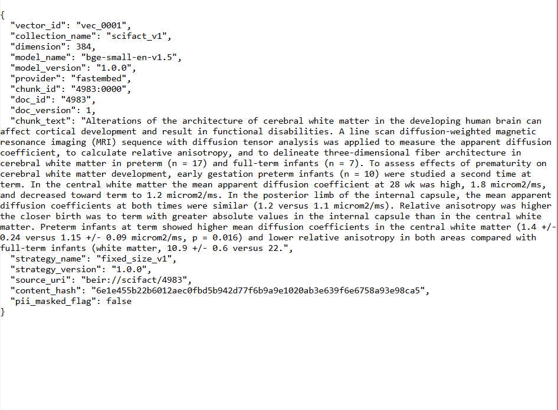

The same trace from the operator CLI:

```powershell
python -m cli.gvpctl lineage trace "vec_0001"
```

```
Vector: vec_0001
Document -> Chunk -> Model -> Qdrant Index
vector_id: vec_0001
document: 4983 (v1)
chunk: 4983:0000
model: bge-small-en-v1.5:1.0.0
collection: scifact_v1
strategy: fixed_size_v1:1.0.0
source_uri: beir://scifact/4983
```

> Vector ids are `vec_0001` … `vec_7620`, generated by `embedding/embedder.py:100`. A request for an unknown id now fails loudly rather than inventing a plausible answer.

### Point-level payload inspection

Every Qdrant point carries its own provenance, so provenance survives independently of the catalog:

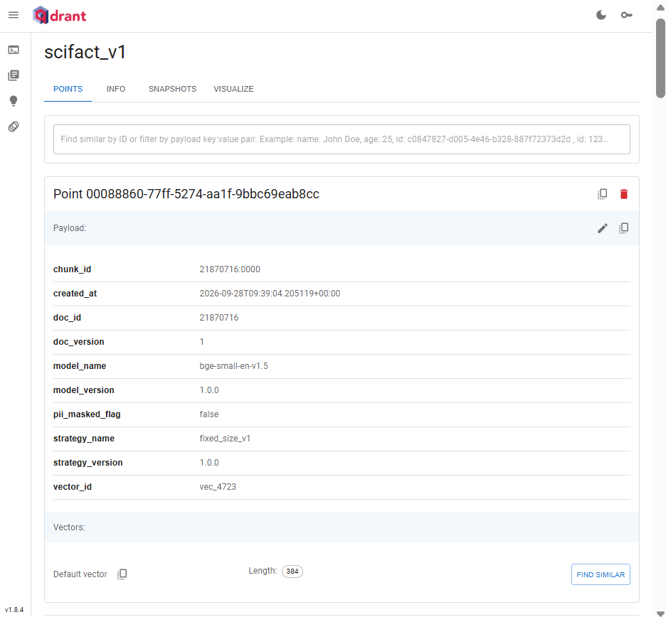

### Live search

Queries are embedded by the active model and served from Qdrant with per-request telemetry:

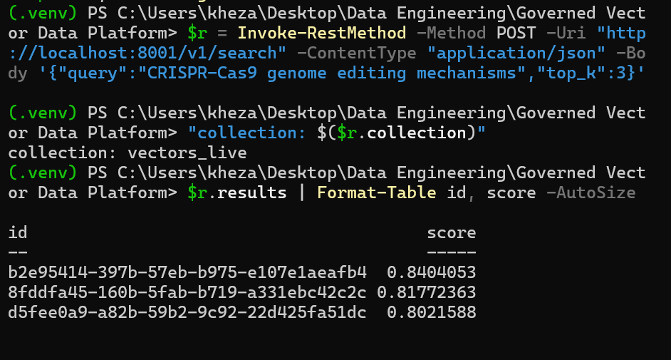

```powershell
$r = Invoke-RestMethod -Method POST -Uri "http://localhost:8000/v1/search" `
  -ContentType "application/json" `
  -Body '{"query":"CRISPR-Cas9 genome editing mechanisms","top_k":3}'
"collection: $($r.collection)"
$r.results | Format-Table id, score -AutoSize
```

```
collection: vectors_live

id                                        score
--                                       -----
b2e95414-397b-57eb-b975-e107e1aeafb4  0.8404053
8fddfa45-160b-5fab-b719-a331ebc42c2c  0.81772363
d5fee0a9-a82b-59b2-9c92-22d425fa51dc  0.8021588
```

> `/v1/search` echoes the full 384-float query vector and complete payloads. Project the `.results` field as above — the raw response is roughly 400 lines.

### Drift visibility

Active versus stale vectors, by model and by chunk strategy:

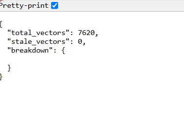

```json
{ "total_vectors": 7620, "stale_vectors": 0, "breakdown": {} }
```

```powershell
python -m cli.gvpctl staleness
```

```
              Staleness Summary
+-------------------------------------------+
| Model             | Active | Stale | Risk |
|-------------------+--------+-------+------|
| bge-small-en-v1.5 | 7620   | 0     | low  |
| fixed_size_v1     | 7620   | 0     | low  |
+-------------------------------------------+
```

### Control plane & observability

The FastAPI control plane exposes health, search, lineage, staleness, routing, and Prometheus metrics:

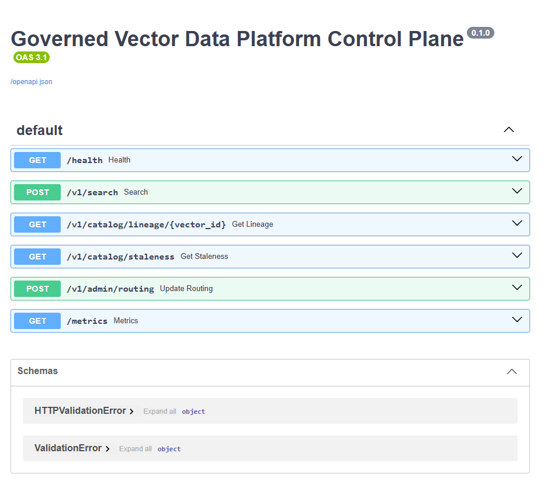

Prometheus scrapes the control plane every 5 seconds and reports the target healthy:

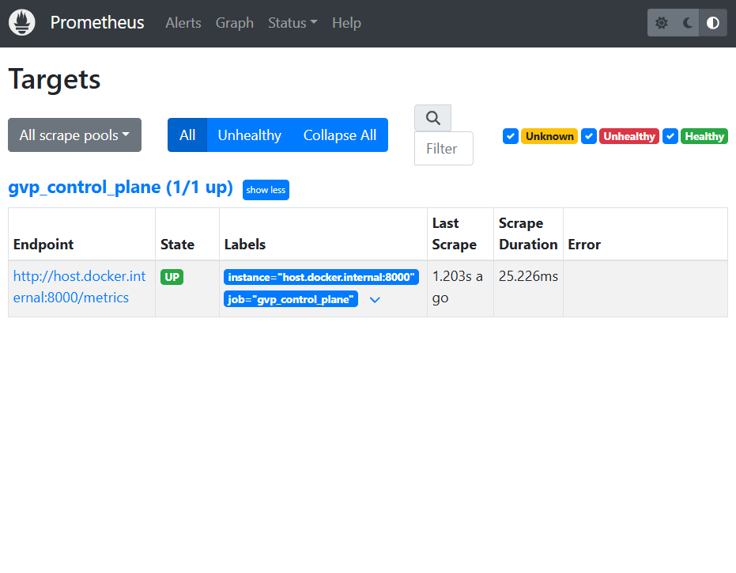

Grafana turns that into live latency percentiles, throughput, token, and cost panels:

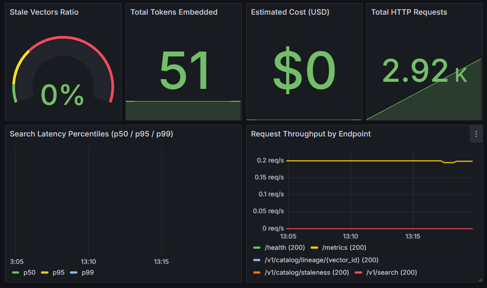

---

## 🛠️ Operator CLI

```powershell
# 1. Inspect platform health and vector distribution
python -m cli.gvpctl status

# 2. Generate a pre-flight migration plan
python -m cli.gvpctl migrate plan "bge-small-en-v1.5" "bge-large-en-v1.5" --approve

# 3. Asynchronously shadow-write target embeddings   (needs bge-large)
python -m cli.gvpctl migrate apply "<MIGRATION_ID>" --approve

# 4. Evaluate the automated IR quality gate          (needs bge-large)
python -m cli.gvpctl quality-gate check "<MIGRATION_ID>"

# 5. Atomically execute cutover, zero downtime       (needs bge-large)
python -m cli.gvpctl cutover execute "<MIGRATION_ID>" --approve

# 6. Test chaos-injection resilience                 (needs bge-large)
python -m cli.gvpctl chaos inject --fail-rate 0.4 --migration-id "<MIGRATION_ID>"

# 7. Instant rollback if needed                      (needs bge-large)
python -m cli.gvpctl cutover rollback "<MIGRATION_ID>" --approve
```

> ⚠️ **`<MIGRATION_ID>` is generated per run, not fixed.** Read it off the `migrate plan` table and reuse that exact value. Each `migrate plan` invocation mints a new id and leaves the previous row in the catalog, so repeated rehearsals accumulate duplicate `planned` migrations. Current catalog state — two stale plan rows, both `planned`, both `migrated_vectors = 0`:

| migration_id | source | target | status | created |
|---|---|---|---|---|
| `mig_77407a443e4d` | bge-small-en-v1.5 | bge-large-en-v1.5 | `planned` | 11:15 |
| `mig_24f052fd669d` | bge-small-en-v1.5 | bge-large-en-v1.5 | `planned` | 13:43 |

Steps 3–7 additionally require the `bge-large-en-v1.5` model, which is not yet downloaded on this machine.

---

## ✅ Verified vs. Pending

| Area | State | Evidence |
|---|---|---|
| Infrastructure stack | ✅ 6 containers up | Qdrant + Postgres healthy |
| SciFact ingestion | ✅ 5,183 documents | `data/raw/scifact/` |
| Chunking + embedding | ✅ 7,620 chunks / vectors | Qdrant `points_count = 7620` |
| Governed catalog | ✅ synced | `gvpctl status` → `duckdb_sync: synced` |
| Provenance & lineage | ✅ full chain | `api_vector_lineage.png` |
| Search | ✅ live, real scores | `cli_search_results.png` |
| Staleness / drift | ✅ 7,620 active, 0 stale | `api_catalog_staleness.png` |
| API + telemetry | ✅ endpoints live | `fastapi_openapi_docs.png` |
| Prometheus → Grafana | ✅ target up, panels plotting | `grafana_telemetry_dashboard.png` |
| Test suite | ✅ 78 passed | `python -m pytest tests/ -q` |
| Migration lifecycle | ⏳ pending | needs `bge-large` (1.34 GB model) |
| Shadow collection | ⏳ created, empty | `scifact_v2_shadow`, 0 points, 1024-dim |
| Marquez lineage graph | ⏳ empty | UI reachable, no datasets ingested yet |
| IR benchmark table | ⏳ placeholder | see below |

Two screens are deliberately shown in their honest, empty state rather than cropped out:

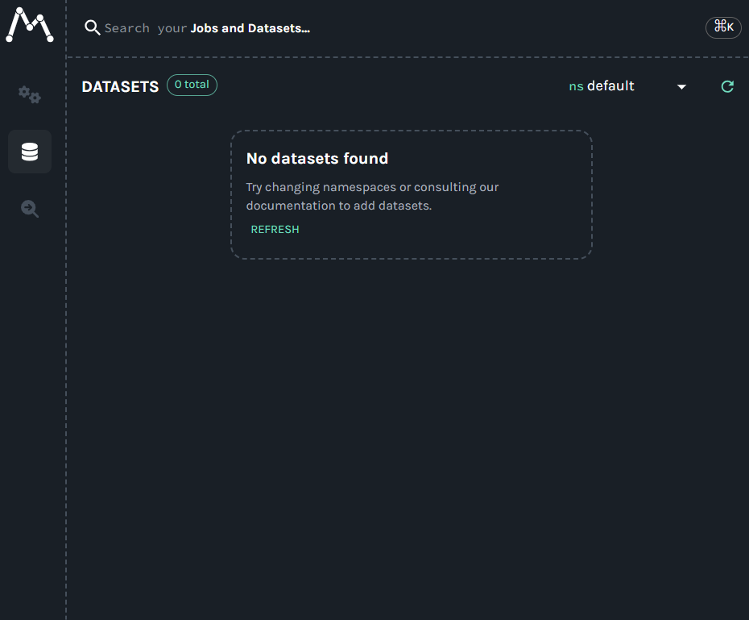

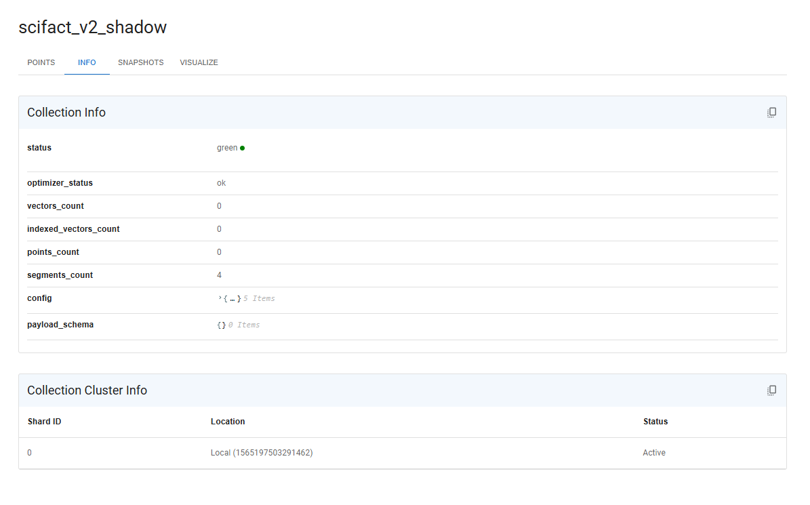

OpenLineage events are emitted during embedding and migration, so the Marquez graph populates once the `bge-large` migration build runs.

---

## Benchmark Comparison: SciFact Ground Truth

Evaluated on 5,183 scientific paper abstracts and expert human relevance judgments (`qrels/test.tsv`):

| Metric | Baseline: `bge-small-en-v1.5` (384d) | Target: `bge-large-en-v1.5` (1024d) | Change | Quality Gate Rule | Status |
|---|---:|---:|---:|---|:---:|
| **Recall@5** | illustrative | illustrative | pending | observed | not yet verified |
| **Recall@10** | illustrative | illustrative | pending | $v_2 \ge v_1 - 0.02$ | not yet verified |
| **NDCG@10** | illustrative | illustrative | pending | $v_2 \ge v_1$ | not yet verified |
| **MRR** | illustrative | illustrative | pending | observed | not yet verified |
| **p95 Latency** | illustrative | illustrative | pending | observed | not yet verified |
| **Error Rate** | pending | pending | pending | $\text{Error Rate} = 0.0$ | not yet verified |

> The table is a placeholder until the shadow collection is populated and `python -m cli.gvpctl quality-gate check` completes. Do not cite these values as measured results.

---

## 🚀 Running the Stack

Six containerised services come up with one command:

```powershell
docker compose up -d
```

| Service | URL | Credentials |
|---|---|---|
| Qdrant Vector Engine | http://localhost:6333/dashboard | — |
| Marquez Lineage UI | http://localhost:3000 | — |
| Grafana Dashboards | http://localhost:3001 | `admin` / `admin` |
| Prometheus | http://localhost:9090 | — |

FastAPI runs separately from Docker Compose:

```powershell
python -m uvicorn api.main:app --host 127.0.0.1 --port 8000
```

- Health: http://localhost:8000/health → `{"status":"ok"}`
- OpenAPI docs: http://localhost:8000/docs
- Prometheus metrics: http://localhost:8000/metrics

> ⚠️ **Do not run `python -m ingestion.bootstrap` casually.** It is only idempotent for the catalog half; it unconditionally re-embeds all 7,620 chunks through `bge-small` on CPU — about **40 minutes**, with no output until it finishes. DuckDB permits a single writing process, so a second concurrent run dies immediately with `IOException: ... being used by another process`. Run it once to build; afterwards only read. See the [Demo Guide](Demo_Guide.md#part-a--one-time-build--already-done--do-not-re-run).

---

## 🧪 Development & Test Suite

```powershell
python -m pip install -r requirements.txt
& .venv\Scripts\Activate.ps1
python -m pytest tests/ -q
```

```
78 passed, 1 warning in 11.16s
```

The suite covers ingestion and sanitization, chunking, catalog schema and transactions, embedding and migration, quality gates, chaos resilience, OpenLineage facets, telemetry, and the CLI. One test (`test_qdrant_client_matches_configured_server_api`) queries the live Qdrant server, so the stack must be running.

---

## 🖼️ Media

| Asset | Contents |
|---|---|
| `architecture.svg` | End-to-end pipeline diagram (vector, scales cleanly) |
| `architecture_pipeline.png` | Rendered PNG of the same diagram |
| `qdrant_baseline_collection.png` | `scifact_v1` — 7,620 points, green |
| `qdrant_point_payload.png` | A single point's full provenance payload |
| `api_vector_lineage.png` | Full backward lineage response, including chunk text |
| `api_catalog_staleness.png` | Staleness breakdown JSON |
| `cli_search_results.png` | Search results with real scores |
| `fastapi_openapi_docs.png` | Control plane OpenAPI surface |
| `prometheus_scrape_targets.png` | `gvp_control_plane` target, 1/1 up |
| `grafana_telemetry_dashboard.png` | Telemetry dashboard (cropped) |
| `grafana_telemetry_dashboard_with_nav.png` | Same dashboard including Grafana nav chrome |
| `qdrant_shadow_collection_empty.png` | `scifact_v2_shadow` — pre-created, 0 points |
| `marquez_lineage_empty.png` | Marquez UI — no datasets yet |
| `qdrant_dashboard.png` | Qdrant collections overview |
| `demo_walkthrough.gif` | Animated CLI walkthrough |
