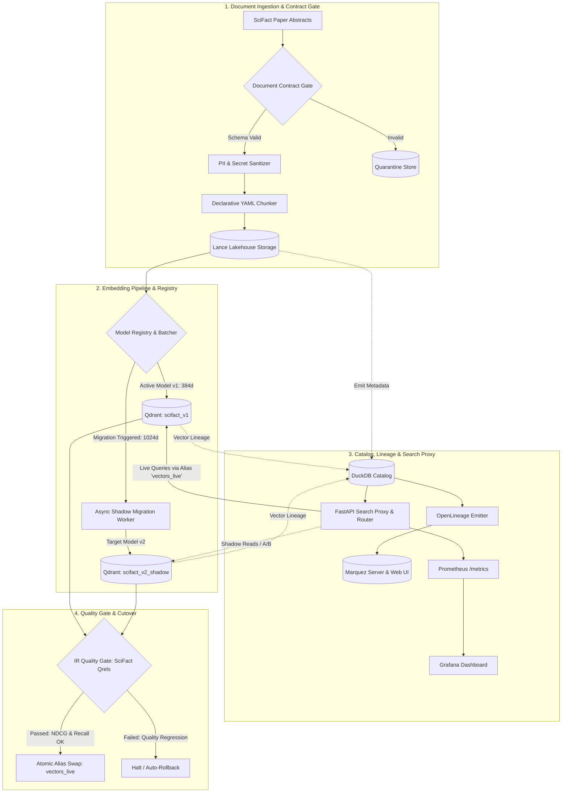

# Architecture Specification

## 1. System Overview

The **Governed Vector Data Platform** provides enterprise governance, provenance tracking, and zero-downtime migration control for unstructured vector data. It bridges the gap between traditional data engineering catalogs and black-box vector databases.

---

## 2. Core Architectural Principles (ADRs)

### ADR-001: Decoupled Lakehouse Storage vs. Dedicated Serving Engine
- **Storage Layer (Lance Format)**: Raw documents and chunk versions are stored in append-friendly, compressed columnar Lance tables (`data/lance_lakehouse/chunks.lance`). Lance provides zero-copy reads, high disk compression, and native support for multi-modal vector datasets.
- **Serving Engine (Qdrant)**: High-concurrency approximate nearest neighbor (ANN) search index with HNSW indexing and native **Collection Aliases (`update_collection_aliases`)**. Collections are isolated by model version (`scifact_v1`, `scifact_v2_shadow`), and live search traffic targets a stable alias (`vectors_live`).

### ADR-002: Dual-Tier Metadata Architecture (DuckDB + OpenLineage)
- **DuckDB Internal Catalog**: Sub-millisecond relational queries for the FastAPI search proxy, staleness detection, backward/forward lineage resolution, and batch planning.
- **OpenLineage & Marquez**: Enterprise-wide governance interoperability. The platform emits standard `RunEvent` messages with the custom, versioned `gvp_VectorEmbeddingDatasetFacet` schema to Marquez.

### ADR-003: Ground-Truth Evaluation on BEIR / SciFact
- Evaluation is executed against 5,183 scientific paper abstracts with expert human-annotated relevance judgments (`evaluation/beir_scifact_qrels.json`).
- Prevents synthetic evaluation bias by using standard Information Retrieval metrics (**Recall@5, Recall@10, NDCG@10, MRR**).

---

## 3. Data Flow & Subsystems

---

## 4. Metadata Catalog Schema (DuckDB)

The DuckDB catalog (`data/catalog.duckdb`) persists complete relational provenance:

| Table | Primary Key | Description |
|---|---|---|
| `documents` | `(doc_id, doc_version)` | Source URI, content hash, ingestion timestamp, and PII masking status. |
| `chunk_strategies` | `(strategy_name, strategy_version)` | Chunk size, token overlap, tokenizer type, and splitting algorithm. |
| `chunks` | `chunk_id` | Document foreign key, chunk index, text snippet, and chunk hash. |
| `embedding_models` | `(model_name, model_version)` | Dimensions, provider, pricing per 1K tokens, and p95 latency SLA. |
| `vectors` | `vector_id` | Qdrant point ID, collection name, dimension, active/stale flag, and foreign keys. |
| `migrations` | `migration_id` | Source/target models, planned count, migrated count, status, and duration. |
| `migration_events` | `event_id` | Audit trail of cutover, rollback, checkpoint, and error events. |
| `retrieval_eval_runs` | `run_id` | Historical IR evaluation runs: Recall@5, Recall@10, NDCG@10, MRR, and drift. |

---

## 5. Zero-Downtime Migration Control Plane

1. **Pre-Flight Planning (`gvpctl migrate plan`)**:
   - Queries `CatalogDB` for all active vectors tied to the source model.
   - Calculates estimated token volume, API pricing, runtime, and predicted vector drift.
2. **Asynchronous Shadow Writing (`gvpctl migrate apply`)**:
   - Scans Lance chunks and computes new embeddings with rate limiting and exponential backoff retry.
   - Writes points into `scifact_v2_shadow` with `active = False` metadata in DuckDB.
   - Emits OpenLineage run events to Marquez.
3. **Automated Quality Gate (`gvpctl quality-gate check`)**:
   - Evaluates both collections against the 300 SciFact query relevance judgments.
   - Enforces invariant gates:
     - `Recall@10(v2) >= Recall@10(v1) - 0.02`
     - `NDCG@10(v2) >= NDCG@10(v1)`
     - `Error Rate == 0.0`
4. **Atomic Cutover (`gvpctl cutover execute`)**:
   - Executes atomic collection alias swap in Qdrant.
   - Updates DuckDB vector active flags and routing policy YAML atomically.
5. **Instant Rollback (`gvpctl cutover rollback`)**:
   - Reverses alias pointer back to `scifact_v1` and restores active vector state in catalog within milliseconds.