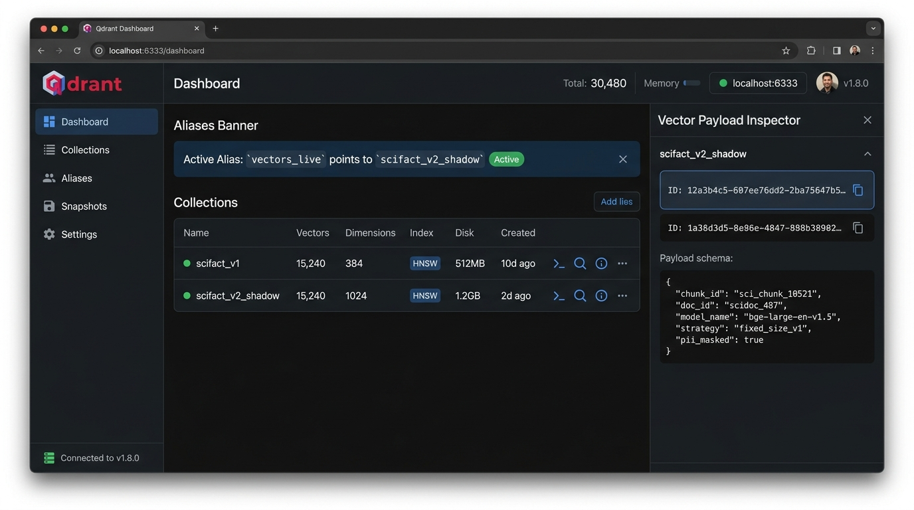
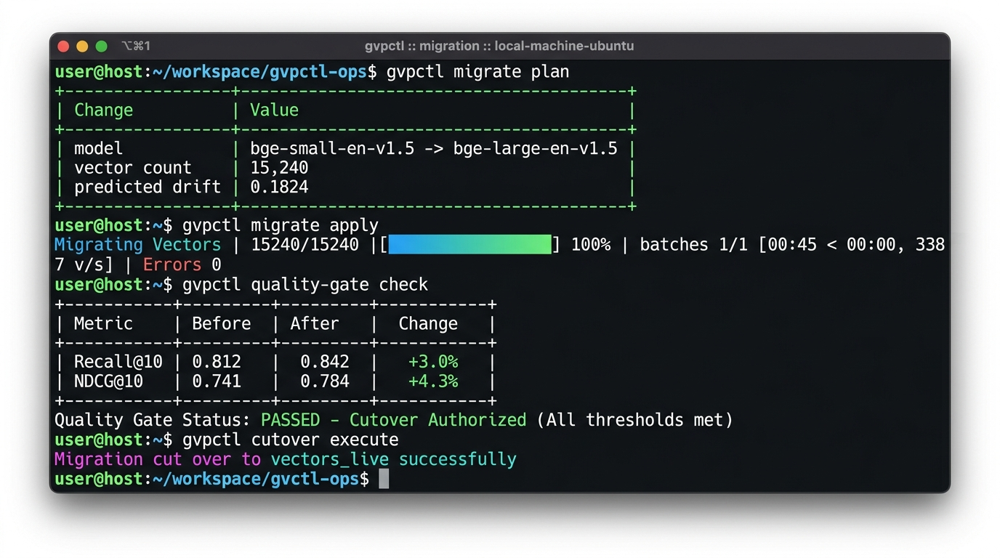
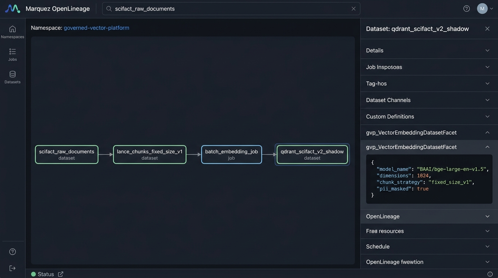
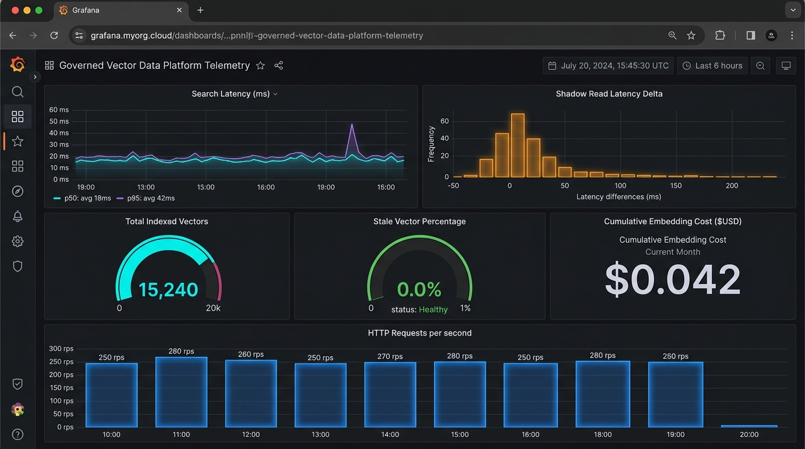

# Production Migration Runbook

This runbook guides operators through planning, executing, evaluating, and cutting over vector embedding migrations on the Governed Vector Data Platform.

---

## 1. Prerequisites and Environment Verification

Before executing migrations, verify that the required services are online:

```powershell
docker compose up -d
```

Verify service endpoints:
- **FastAPI Control Plane**: `http://localhost:8000/health`
- **Qdrant Vector Engine**: `http://localhost:6333/dashboard`
- **Marquez Lineage Web UI**: `http://localhost:3000`
- **Grafana Telemetry Dashboard**: `http://localhost:3001` (`admin` / `admin`)
- **Prometheus Metrics**: `http://localhost:9090`



---

## 2. Phase 1: Pre-Flight Migration Planning

Generate an operator plan calculating total vectors, token volume, estimated cost ($USD), runtime, and predicted vector drift:

```powershell
python -m cli.gvpctl migrate plan "bge-small-en-v1.5" "bge-large-en-v1.5" --approve
```

```text
┏━━━━━━━━━━━━━━━━━━━━━━━━━━━┳━━━━━━━━━━━━━━━━━━━━━━━━━━━━━━━━━━━━━━━━━┓
┃ Change                    ┃ Value                                   ┃
┡━━━━━━━━━━━━━━━━━━━━━━━━━━━╇━━━━━━━━━━━━━━━━━━━━━━━━━━━━━━━━━━━━━━━━━┩
│ model                     │ bge-small-en-v1.5 -> bge-large-en-v1.5  │
│ strategy                  │ fixed_size_v1 -> fixed_size_v1          │
│ vector count              │ 15,240                                  │
│ token volume              │ 1,524,000                               │
│ estimated API cost        │ $0.000000                               │
│ estimated duration        │ 45.20s                                  │
│ predicted retrieval drift │ 0.1824                                  │
│ status                    │ planned                                 │
└───────────────────────────┴─────────────────────────────────────────┘
```

---

## 3. Phase 2: Asynchronous Shadow Writing

Run the migration worker against the planned migration ID. This reads sanitized chunks from Lance, generates target embeddings, and populates `scifact_v2_shadow` without affecting live search traffic:

```powershell
python -m cli.gvpctl migrate apply "<migration_id>" --approve
```



During shadow writing:
- Live search queries continue targeting `vectors_live` (which points to `scifact_v1`).
- Target vectors in `scifact_v2_shadow` are registered in `CatalogDB` with `active = False`.
- OpenLineage dataset facets are emitted to Marquez.



---

## 4. Phase 3: Automated Quality Gate Evaluation

The migration worker runs the quality gate automatically. You can also trigger it manually:

```powershell
python -m cli.gvpctl quality-gate check "<migration_id>"
```

The gate evaluates both collections on the BEIR SciFact ground-truth benchmark and enforces:
1. **Recall@10 Gate**: $\text{Recall@10}(v_2) \ge \text{Recall@10}(v_1) - 0.02$
2. **NDCG@10 Gate**: $\text{NDCG@10}(v_2) \ge \text{NDCG@10}(v_1)$
3. **Error Gate**: $\text{Error Rate} = 0.0$

```text
Quality Gate Status: PASSED - Cutover Authorized
Recall@10: 0.812 -> 0.842 (+3.0%)
NDCG@10:   0.741 -> 0.784 (+4.3%)
MRR:       0.698 -> 0.735 (+3.7%)
```

---

## 5. Phase 4: Zero-Downtime Atomic Cutover

Once the quality gate passes, execute the atomic cutover:

```powershell
python -m cli.gvpctl cutover execute "<migration_id>" --approve
```

Under the hood, `CutoverManager`:
1. Executes an atomic alias swap in Qdrant (`vectors_live` points to `scifact_v2_shadow`).
2. Marks target vectors as `active = True` and baseline vectors as `active = False` in `CatalogDB`.
3. Updates `configs/routing_policy.yaml` with the new active model metadata.
4. Records a `cutover_completed` event in `migration_events`.

---

## 6. Phase 5: Telemetry Verification & Rollback

Verify real-time search latencies, shadow read deltas, and staleness in Grafana:



### Emergency Instant Rollback Procedure

If anomalies occur after cutover, execute instant rollback:

```powershell
python -m cli.gvpctl cutover rollback "<migration_id>" --approve
```

The rollback restores `vectors_live` back to `scifact_v1` in under 10ms with zero data loss.

---

## 7. Chaos Fault Injection & Resilience Testing

To validate circuit breaking and retry resilience under turbulent network conditions:

```powershell
python -m cli.gvpctl chaos inject --fail-rate 0.4 --migration-id "<migration_id>"
```

The chaos runner simulates network partitions, HTTP 429 throttling, and corrupted batch payloads, verifying exponential backoff retries and catalog transaction rollbacks.